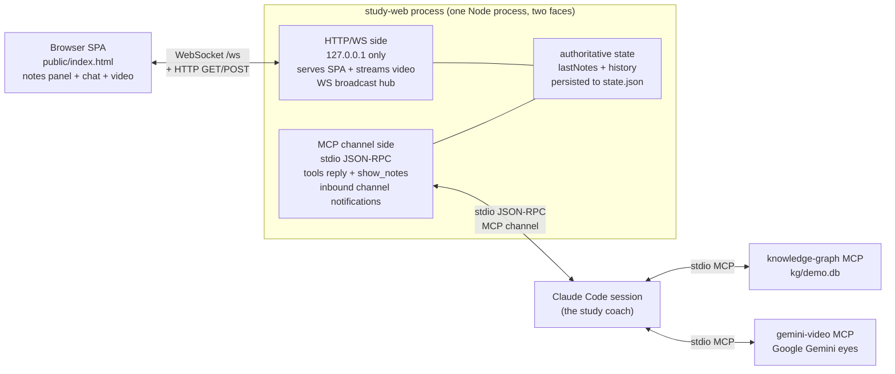
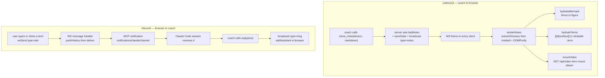
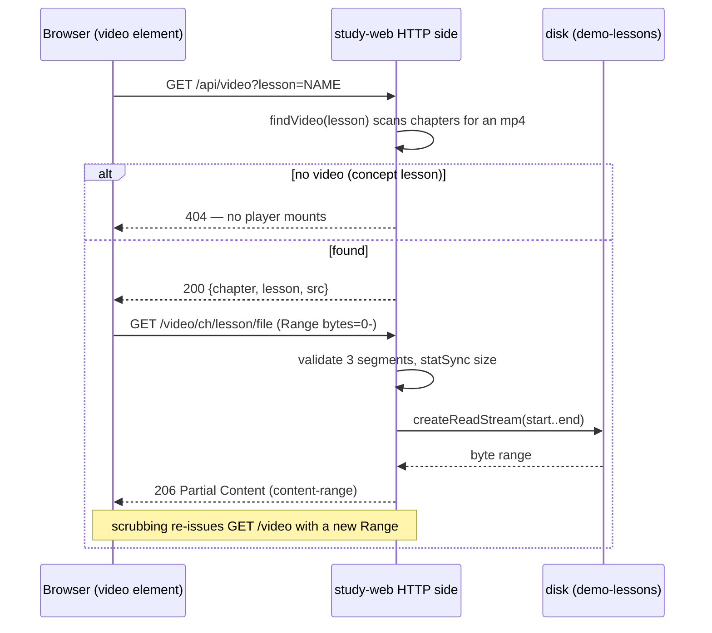

# Architecture

`study-web-cockpit` is a **Claude Code project** — a working directory whose `.mcp.json`
registers a set of MCP (Model Context Protocol) servers that a Claude Code session loads at
startup. The session is the study coach; the MCP servers are the tools it reaches for. Three
servers are wired in:

| Server | Role |
|--------|------|
| `knowledge-graph` | long-term memory — store/connect/recall knowledge nodes in `kg/demo.db` |
| `gemini-video` | delegates video and slide understanding to Google Gemini (the session cannot watch video itself) |
| `study-web` | the cockpit — a browser UI bridged to the session |

The first two are conventional stdio MCP servers (request in, response out). **`study-web` is
the novel one.** It is a single Node process wearing two faces at once:

1. **An MCP `claude/channel` side** — over stdio it both *receives* messages from the
   browser (delivered into the session as `notifications/claude/channel`) and *exposes two
   tools* (`reply`, `show_notes`) the session calls to push content back out.
2. **A localhost HTTP + WebSocket side** — bound to `127.0.0.1` only, it serves the
   single-page app, streams lesson videos, and fan-outs server-pushed events to every open
   browser tab over a WebSocket.

The browser never talks to Claude directly. Every byte in either direction passes through the
`study-web` process, which is the meeting point of the human (browser) and the model (session).

## Component overview



## The `show_notes` round trip (and the reverse `reply` / `ask` path)

When the coach has rewritten a lesson into clickable web-notes it calls the `show_notes` MCP
tool. The server records the markdown as authoritative state and broadcasts it; every connected
browser renders it. The reverse path carries a user message from the browser into the session,
optionally surfacing as a coach `reply`.



`reply` and `show_notes` are symmetric in implementation: both append to / replace the
authoritative state and then `broadcast(...)` a JSON frame over WebSocket. A `reply` becomes a
chat bubble (`type:"msg"`); a `show_notes` replaces the reading panel (`type:"notes"`).

## Video playback (Range streaming)

Chapter-07 lessons ship an `.mp4` next to their notes. When `mountVideo` runs it asks the
server to locate the file, then points a `<video>` element at a `/video/...` URL. The browser's
media element drives the rest with HTTP Range requests so the scrubber works without downloading
the whole file.



## Design notes

**Authoritative state + snapshot-on-reconnect.** The browser holds no durable state. The
server keeps the single source of truth — `lastNotes` (the last shown notes) and a capped
`history` of chat turns — and persists it to `state.json` (debounced, plus an immediate flush
on shutdown). On *every* WebSocket connection the server immediately sends a `snapshot` frame;
`applySnapshot` rebuilds the reading panel and replays the chat log. A page refresh, a second
tab, or a brief disconnect all converge to the same view, and closing/relaunching the coach
session restores the last lesson rather than wiping it.

**The stdout-poison guard.** Under MCP stdio transport, `stdout` is reserved for JSON-RPC
frames — a single stray `console.log` (from this code or any dependency) would corrupt the
protocol stream and silently break the channel. The first executable lines of `server.js`
reassign `console.log` and `console.info` to `console.error`, forcing all human-readable
logging to `stderr` where it is harmless.

**The clickable-term contract.** Notes markdown carries inline `[[id|surface]]` markers and
exactly one ` ```glossary ` JSON block. `extractGlossary` pulls the JSON into a global `GLOSS`
table and strips the block before rendering; `hydrateTerms` walks text nodes (skipping
`code`/`pre`/`mermaid`/already-hydrated nodes) and turns each marker whose `id` exists in
`GLOSS` into a clickable `.term`. Clicking opens a definition card that can escalate to a
"deeper" question — which travels back to the coach as an `ask` of `mode:"deeper"`. A small
guard rewrites `]](` to insert a zero-width space so `marked` never mis-parses a term marker as
a markdown link.

**RFC 7233 Range streaming + traversal guard.** `/video/...` implements HTTP Range
(RFC 7233): it parses `bytes=start-end` (including the suffix form `bytes=-N`), replies `206
Partial Content` with a correct `content-range`/`content-length`, advertises `accept-ranges:
bytes`, and returns `416` for an unsatisfiable range. Because the path names files on disk, it
is hard-guarded even though it is `127.0.0.1`-only: the URL must decode to exactly three
single-name segments, none containing `..` or a slash, and the last must match the video
extension regex; `/api/notes` and `/api/video` apply the same single-segment check to their
`chapter`/`lesson` query params. Stream I/O errors are caught and turned into `res.destroy`
rather than an `uncaughtException`, since the same process is also the MCP channel and the WS
hub.
