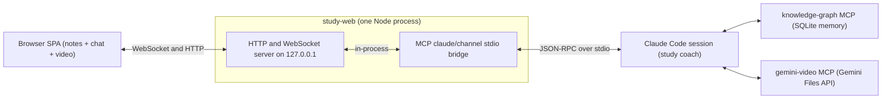

# study-web-cockpit

**A real-time AI tutoring UI built on a Claude Code MCP channel.**

`Local-first` · `Node.js + Model Context Protocol + WebSocket` · `vendored SQLite knowledge graph` · a proof-of-concept, not a product.


_(demo GIF — see [`docs/`](docs/) for how it's recorded)_

---

## Why

LLM coding agents live in a terminal. That's fine for code, but a terrible classroom: there's no place to *read* annotated material, no synced video, and nothing the agent says survives the next `/compact`.

`study-web-cockpit` gives the agent a **browser cockpit**. The agent (a Claude Code "study coach") drives a two-pane web UI over a live MCP channel: it pushes rewritten, **clickable annotated notes** into a reading panel and chats in a side panel, while a **synced video player** lets the learner click an `[MM:SS]` timestamp in the notes to jump the recording to that moment. Click any highlighted term and the agent explains it *in the lesson's context*, not in the abstract.

Underneath, everything the coach teaches is written into a **long-term knowledge graph** (vendored, local SQLite) with trust levels, spaced-repetition decay, and anti-fabrication guards — so a lesson learned in one session is recalled, and quizzed, in the next.

## Architecture

One Node process wears **two faces at once**: it is both an MCP `claude/channel` stdio bridge (talking JSON-RPC to the Claude Code session over stdin/stdout) **and** the localhost web server (HTTP + WebSocket) the browser connects to. Two more MCP servers round out the coach: the **knowledge-graph** engine (long-term memory) and **gemini-video** (delegates video/PDF understanding to Gemini, since the agent can't watch video itself).



Inbound, a browser message becomes a `notifications/claude/channel` notification into the session. Outbound, the coach calls the channel's `reply` (chat) and `show_notes` (reading panel) tools, which broadcast over WebSocket to every connected tab. See **[ARCHITECTURE.md](ARCHITECTURE.md)** for the full data-flow walkthrough.

## Key technical decisions / trade-offs

- **Dual-face single process.** The channel bridge and the web server share one process so the browser and the Claude session see the *same* in-memory session state with no IPC. The cost: the HTTP/WS server must never crash the process (a stray throw would also kill the MCP channel), so every stream error is caught and demoted.
- **stdout-poison guard.** MCP stdio reserves stdout for JSON-RPC, so a single stray `console.log` (ours or a dependency's) corrupts the protocol. The entry point reassigns `console.log = console.error` up front to force all logging to stderr.
- **Authoritative server-side session state.** The browser holds no durable state; the server keeps the last notes + chat history and replays a `snapshot` frame on every WebSocket (re)connect — so a refresh, a reconnect, or a second tab rebuilds instantly and catches up on anything sent while it was away. State is also persisted to disk so closing the session doesn't wipe the reading panel.
- **RFC 7233 Range video streaming.** The `/video/...` route serves local recordings with `206 Partial Content` + `Content-Range` (including suffix `bytes=-N` ranges), so the scrubber actually works instead of forcing a full download before seeking.
- **Clickable-term contract + validator.** Notes use an `[[id|surface]]` marker syntax plus exactly one `glossary` JSON block; `scripts/check-web-notes.mjs` validates every file (one well-formed glossary, every marker resolved, no pipe-form markers inside table rows) so malformed notes fail fast instead of rendering broken.
- **Vendored KG engine with a patched path resolver.** The knowledge-graph engine ships in-tree (`kg/`) so the project runs offline on clone; its `--db` path resolver is patched to resolve relative to the project root (`process.cwd()`), matching the relative-path convention `.mcp.json` and hooks use across machines.

Long-form, ADR-style design docs for each of these live under **[`plans/`](plans/)**.

## Tech stack

| Tool | Why |
|------|-----|
| **Node.js** (ESM, native `node:http`) | Single runtime for the dual-face server; no framework needed for a localhost SPA host. |
| **@modelcontextprotocol/sdk** (low-level `Server`) | The low-level `Server` is required to declare the experimental `claude/channel` capability the channel bridge depends on. |
| **ws** | Minimal WebSocket server bound to the same HTTP server — the live push channel to the browser. |
| **better-sqlite3 + sqlite-vec + FTS5** | The KG store: synchronous SQLite, vector KNN (sqlite-vec), and BM25 full-text (FTS5) for hybrid recall — all local, zero network. |
| **Gemini Files API** (`@google/genai`) | The agent can't watch video or read PDFs; Gemini ingests the lesson media and answers scoped, timestamped questions. |
| **marked / mermaid / DOMPurify** | Render the coach's markdown notes, draw architecture diagrams inline, and sanitize all rendered HTML (notes come from the model). |

## Repository tour

| Path | What it is |
|------|-----------|
| **`study-web/`** | The cockpit. `server.js` is the dual-face MCP-channel + HTTP/WebSocket server; `public/index.html` is the browser SPA (term/timestamp hydration, video panel); `lib/video-http.js` holds the Range parser + path guard, with unit tests beside it. |
| **`mcp-gemini-video/`** | MCP server that delegates video/PDF understanding to the Gemini Files API. |
| **`kg/`** | Vendored knowledge-graph engine (MIT) plus this project's Claude Code hooks and the patched relative-path resolver. |
| **`scripts/`** | Setup verifier, web-notes validator, WAL-aware KG git-sync, transcript helper. |
| **`demo-lessons/`** | The hand-authored "URL Shortener" demo lesson — clickable notes + timestamped video notes. |
| **`plans/`** | ADR-style design docs (the cockpit; the video feature) — the reasoning behind the decisions above. |
| **`COACH-SPEC.md`** | How the Claude agent is programmed: trust taxonomy, KG conventions, pedagogy loop. |
| **`ARCHITECTURE.md`** | Component diagrams + the full data-flow walkthrough. |

## Quick start

```bash
# 1. Install deps in each sub-package
(cd kg && npm install)              # vendored KG engine (builds a native SQLite module)
(cd mcp-gemini-video && npm install)
(cd study-web && npm install)

# 2. Verify the setup
node scripts/check-setup.mjs

# 3. (optional) seed the demo knowledge graph — powers spaced review + traverse_graph
node scripts/seed-demo-kg.mjs       # kg/demo-seeds.json -> kg/demo.db (full-text; vectors optional)

# 4. Launch the coach (starts Claude Code with the cockpit loaded as a channel)
#    Windows:  study-coach.cmd
#    macOS:    ./study-coach.command   (chmod +x it the first time)
```

Then open the **`http://127.0.0.1:...`** URL the launcher prints, and click the **"01. URL Shortener"** demo lesson on the welcome screen.

> **`GEMINI_API_KEY`** is only needed for the video-ingestion server (`gemini-video`). Copy `mcp-gemini-video/.env.example` → `mcp-gemini-video/.env` and drop your key in. The cockpit, chat, notes, and knowledge graph all work without it — only video/PDF *ingestion* needs Gemini.

## The demo lesson

`demo-lessons/01_Demo/01. URL Shortener/` is **hand-authored original content** that exercises the whole UI: clickable glossary terms (`[[id|surface]]` markers) in the reading panel, and timestamped `[MM:SS]` video notes that drive the player.

To light up the video player, **drop a short self-recorded screen capture** in as the lesson's `.mp4` (any `.mp4` in the lesson folder is auto-detected; the file is local and git-ignored). With no video present the lesson still renders fully — it just shows no player. The demo GIF above shows the player working end to end.

## What I learned / notable gotchas

- **Channels are a research preview.** Loading a bare `.mcp.json` server as a channel needs `--dangerously-load-development-channels`; plain `claude` will *not* push browser messages into the session. The API surface (`notifications/claude/channel`, the `experimental` capability flag) is unstable and may change.
- **WAL-mode + git don't mix casually.** The SQLite KG runs in WAL mode; you must checkpoint and stop the server before committing or merging the `.db`, or you sync an inconsistent file (a stray `-wal`/`-shm` sidecar means uncommitted writes).
- **Windows + Node SDK quirks.** Uploading files with non-ASCII (Chinese) names to the Gemini Files API crashed on a Latin-1-only HTTP header and on the SDK's native path-streaming path; the fix was to read the file into a `Blob` and upload that (no filename header, different upload code path). `.cmd` launchers must stay ASCII-only because `cmd.exe` misreads non-ASCII bytes.

## Roadmap / limitations

- The **`claude/channel` API is experimental** and gated behind a development flag — treat this as a proof of concept, not a stable integration.
- **Single-user, local-first.** The server binds to `127.0.0.1` only and assumes one learner on one machine; there's no auth or multi-tenant story.
- **One demo lesson** ships in the public repo. The cockpit is built to scale to a full course (it auto-detects videos and notes per lesson folder), but only the URL Shortener lesson is included here.

## Attribution & License

Built on the **Multi-knowledgeGraph** engine (MIT) — see **[THIRD_PARTY_NOTICES.md](THIRD_PARTY_NOTICES.md)**. Engine author: ChenLiangChong.

This repository is released under the **MIT License** — see **[LICENSE](LICENSE)**.
