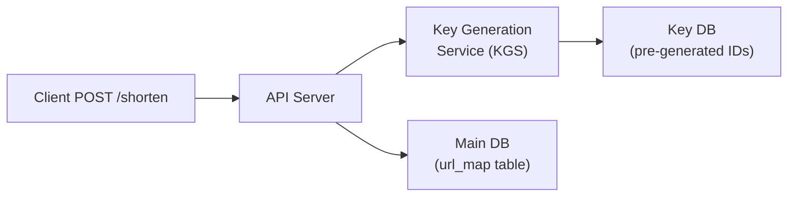
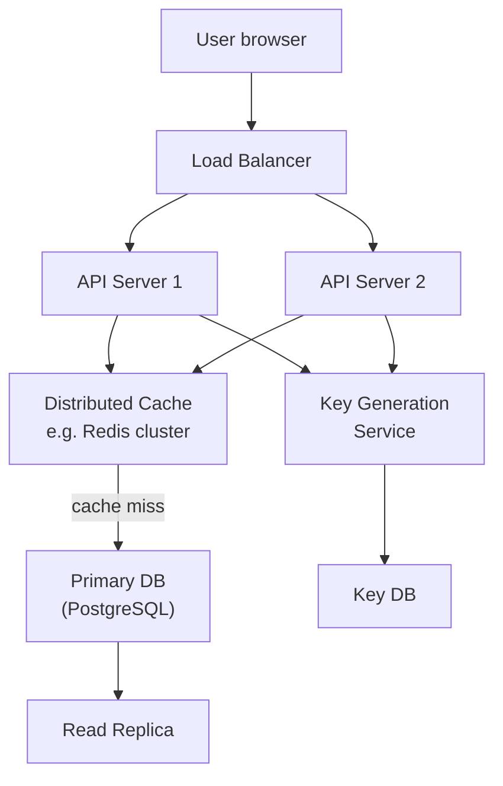

# Design a URL Shortener

> One sentence: a URL shortener maps a long URL to a short code and redirects visitors — it is **read-heavy, latency-sensitive, and a classic system-design warm-up**.

## Why It Is Interesting

A URL shortener looks trivial (two database columns!) but surfaces a cluster of real trade-offs:

- [[id-generation|ID generation]] strategy affects collision rate, throughput, and whether you can scale horizontally.
- [[redirect-type|Redirect type]] (301 vs 302) determines whether browsers and CDNs cache the redirect — with direct revenue impact.
- [[read-heavy|Read-heavy traffic]] means every optimisation dollar should go to the read path first.

---

## Functional Requirements

| Requirement | Decision |
|---|---|
| Shorten a long URL | Yes — core feature |
| Redirect to original | Yes — core feature |
| Custom alias | Optional (MVP: no) |
| Expiry / TTL | Optional (MVP: yes, default 1 year) |
| Analytics (click count) | Out of scope for MVP |

---

## Non-Functional Requirements

- **Availability**: 99.9 % uptime (redirect must always work)
- **Latency**: redirect P99 < 20 ms
- **Scale**: 100 M shortens / day write; 10 B redirects / day read
- **Durability**: short codes must never silently change or disappear before expiry

---

## Capacity Estimates

| Metric | Estimate |
|---|---|
| Write RPS | ~1 200 req/s |
| Read RPS | ~120 000 req/s |
| [[read-write-ratio]] | ~100 : 1 |
| Short code length (base62, 6 chars) | 62^6 ≈ 56 billion codes |
| Storage per record | ~500 B → ~50 GB for 100 M records |

---

## Short Code Generation

Given 100 M new URLs per day over many years, we need billions of unique short codes. Two main approaches:

### Option A — Hash-and-Truncate

Take a [[hash-function|hash]] of the long URL (e.g. MD5 / SHA-256), then [[base62-encoding|base62-encode]] and keep the first 6–8 characters.

Pros: stateless, deterministic (same URL → same code, dedup for free).
Cons: [[hash-collision|hash collision]] risk at scale; collisions require a retry loop.

### Option B — Counter + Base62

A global counter (or [[snowflake-id|Snowflake-style ID]]) produces a unique integer, then base62-encode it to produce the short code.



Pros: no collision, simple logic, predictable length growth.
Cons: the counter is a [[single-point-of-failure|single point of failure]] if centralised; use a KGS with pre-allocated ID batches to mitigate.

> **Interview tip**: prefer the counter approach and call out that the KGS hands out ID batches to each API server — no single-machine bottleneck.

---

## Redirect: 301 vs 302

This is a favourite interview question. The difference comes down to **who caches the redirect**.

| Code | Name | Caching | Use case |
|---|---|---|---|
| [[http-301]] | Moved Permanently | Browser caches forever | Stable aliases — reduces server load |
| [[http-302]] | Found (Temporary) | Browser re-requests every time | Analytics tracking, A/B tests |

For a URL shortener that wants **accurate click analytics**, choose [[http-302]] — the browser always asks the server, so every redirect is counted. If analytics are not needed and you want to minimise server load, [[http-301]] lets the browser skip the server entirely on repeat visits.

> RFC 7231 §6.4.2: "The 301 (Moved Permanently) status code indicates that the target resource has been assigned a new permanent URI." — the user agent **should** update its bookmarks and not re-request the original URI.

---

## Data Model

```
Table: url_map
  id          BIGINT PRIMARY KEY   -- the numeric counter value
  short_code  VARCHAR(8) UNIQUE    -- base62 of id
  long_url    TEXT NOT NULL
  created_at  TIMESTAMP
  expires_at  TIMESTAMP
  user_id     BIGINT               -- nullable for anonymous
```

Index on `short_code` (lookup path) and `long_url` (optional dedup check).

---

## System Architecture



Request flow for a **redirect**:

1. User GETs `https://short.ly/aB3xYz`
2. Load balancer routes to an API server.
3. API server looks up `aB3xYz` in [[redis-cache|Redis cache]] — **cache hit** returns the long URL instantly (< 1 ms).
4. On **cache miss**, query the [[read-replica|read replica]] (not the primary — protect write path).
5. Return a [[http-302|302 redirect]] to the long URL; optionally emit a click event to a queue for async analytics.

---

## Caching Strategy

Because read/write ratio is ~100:1, caching is the highest-leverage optimisation.

| Layer | Mechanism |
|---|---|
| [[redis-cache]] | Cache `short_code → long_url` with TTL matching the URL's expiry |
| [[cdn-edge]] | For stable (301-style) redirects, a CDN can cache the 301 response at the edge |
| Local in-process cache | Optional small LRU for the hottest 1 000 codes per API server |

[[cache-invalidation|Cache invalidation]] only matters when a short URL is deleted or its destination changes — relatively rare events.

---

## Horizontal Scaling

| Concern | Solution |
|---|---|
| API stateless | [[stateless-api]] — spin up N API servers behind a load balancer |
| DB write bottleneck | Single primary + read replicas; or [[db-sharding]] by short_code range |
| Hot short codes | [[redis-cache]] absorbs 99 % of redirect traffic |
| KGS availability | Two KGS instances each holding a batch of pre-allocated IDs |

---

## Interview Trade-off Summary

The three choices that interviewers probe most:

1. **ID generation**: hash-and-truncate (stateless, collision risk) vs counter+base62 (collision-free, needs KGS).
2. **Redirect type**: 302 for analytics accuracy, 301 for load reduction — must state the trade-off.
3. **Cache policy**: aggressive TTL-based caching is safe here because URL destinations rarely change.

```glossary
{
  "id-generation": {
    "term": "ID Generation 短碼產生",
    "short": "將長 URL 對應到唯一短碼的機制。主要兩種：對長 URL 做 [[hash-function|hash]] 取前幾碼，或用遞增計數器搭配 [[base62-encoding|base62]] 編碼。",
    "deeper": "Hash-and-truncate 與 counter+base62 在碰撞率、水平擴展上各有何取捨？"
  },
  "redirect-type": {
    "term": "Redirect Type 重新導向類型",
    "short": "HTTP 重定向狀態碼。[[http-301]] (永久) 讓瀏覽器快取結果、之後不再問 server；[[http-302]] (暫時) 每次都回問 server，適合需要計數的 analytics。",
    "deeper": "如果要做 A/B 測試或點擊計數，應該選 301 還是 302？為什麼？"
  },
  "read-heavy": {
    "term": "Read-Heavy Workload 讀多寫少工作負載",
    "short": "系統的讀取請求遠多於寫入請求（本例約 100:1）。最佳化策略應優先投入讀取路徑：快取、讀取副本、CDN。"
  },
  "read-write-ratio": {
    "term": "Read-Write Ratio 讀寫比",
    "short": "讀取請求與寫入請求的比例。URL shortener 的讀寫比約 100:1，意味著快取投資回報率極高。"
  },
  "hash-function": {
    "term": "Hash Function 雜湊函數",
    "short": "將任意長度輸入映射到固定長度輸出的函數（例如 MD5、SHA-256）。用於 ID 生成時，需截取前幾個字元作為短碼，存在碰撞風險。"
  },
  "base62-encoding": {
    "term": "Base62 Encoding Base62 編碼",
    "short": "用 0-9、a-z、A-Z 共 62 個字元表示數字。6 個字元可表示 62^6 ≈ 56 億種組合，足夠容納大規模短碼空間，且 URL 安全（無特殊字元）。"
  },
  "hash-collision": {
    "term": "Hash Collision 雜湊碰撞",
    "short": "兩個不同的輸入產生相同的雜湊值（截短後相同的短碼）。在 hash-and-truncate 方案下，碰撞需重試；規模越大，概率越高。"
  },
  "snowflake-id": {
    "term": "Snowflake ID",
    "short": "Twitter 開源的分散式唯一 ID 生成方案：64 位元整數，包含時間戳、機器 ID、序列號。可在多台機器上並行產生不重複 ID，無需協調。"
  },
  "single-point-of-failure": {
    "term": "Single Point of Failure 單點故障",
    "short": "系統中一旦失效就會導致整體不可用的元件。集中式計數器是 SPOF；解法是預先分配 ID 批次給各 API server，或部署多台 KGS 互備。"
  },
  "http-301": {
    "term": "HTTP 301 Moved Permanently",
    "short": "永久重定向。瀏覽器收到後會快取目標 URL，之後直接跳轉不再詢問 server。減少 server 負載，但無法計算每次點擊。",
    "deeper": "為什麼 301 會讓 analytics 低估點擊數？"
  },
  "http-302": {
    "term": "HTTP 302 Found (Temporary Redirect)",
    "short": "暫時重定向。瀏覽器每次都回問 server 確認目標，因此 server 能計數每次點擊。適合 analytics 追蹤和 A/B 測試。"
  },
  "redis-cache": {
    "term": "Redis Cache Redis 快取",
    "short": "In-memory key-value store，常用作應用層快取。查詢延遲約 0.1–1 ms，比資料庫快 10–100 倍。URL shortener 用它快取 short_code → long_url 映射。"
  },
  "read-replica": {
    "term": "Read Replica 讀取副本",
    "short": "將 primary DB 資料同步複製到額外 server，讀取請求打 replica、寫入請求打 primary。保護 primary 的寫入路徑，並分散讀取負載。"
  },
  "cache-invalidation": {
    "term": "Cache Invalidation 快取失效",
    "short": "資料更新時確保快取不繼續回傳舊資料的機制。URL shortener 中，短網址刪除或目標變更時需主動失效對應 cache entry。"
  },
  "cdn-edge": {
    "term": "CDN Edge Cache CDN 邊緣快取",
    "short": "將快取延伸到全球各地的 edge node。對 301 永久重定向，CDN 可在邊緣快取回應，用戶不需回源 server，大幅降低延遲和來源負載。"
  },
  "stateless-api": {
    "term": "Stateless API 無狀態 API",
    "short": "每個 API 請求包含所有必要資訊，server 不儲存 session 狀態。因此可任意水平擴展（spin up N 台），load balancer 隨意路由請求。"
  },
  "db-sharding": {
    "term": "DB Sharding 資料庫分片",
    "short": "將資料水平拆分到多個資料庫節點，每個節點只存部分資料。URL shortener 可按 short_code 範圍或 hash 分片，突破單機寫入上限。"
  }
}
```
