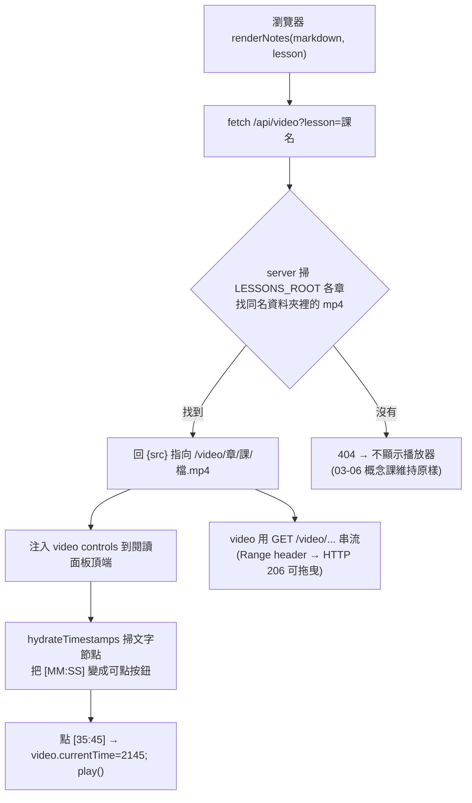

# Ch07 影片實作課 — 座艙與陪讀升級設計 spec

> 依教練的五項投票定案。一句話:**前端只動最小的一刀(影片播放器 + 可點時間戳),陪讀流程大改(先做題、分段看、憑記憶重畫),筆記沿用 `video-notes.md`。**

## Goal(目標)

讓 `07_真實大型應用設計`(14 道「Design X」影片實作課,每課 ~45 分鐘)在 study-web 座艙裡從「只能讀文字筆記」升級成「**看影片 + 點時間戳跳播 + 被教練逼著自己先做**」的主動學習體驗,而且:

- 前端改動**克制**:重用 `video-notes.md` 裡早就存在的 `[MM:SS]` 時間戳,**零重寫**。
- 影片是本機、版權、gitignore 的檔案;server 本來就只綁 `127.0.0.1`,**不增加對外暴露面**。
- 不破壞 03–06 概念課的既有行為(可點術語 `web-notes.md` 流程原封不動)。

## Why ch07 is different(為什麼要分開設計)

03–06 是「一個概念的投影片」;ch07 是「老師在影片裡**從頭解一整道設計題**」。學習科學的重點(來源見附錄):

- 看影片是**答案本**,不是課;留得住的是「**先自己做 → 預測 → 憑記憶重畫**」(generation / drawing effect ≈2× recall;re-watching 已被證據否定)。
- 完整 worked example 對新手有用、對已會的人有害(**expertise reversal**)→ 引導要**隨進度漸退**。
- 45 分鐘連續影片會爆 working memory(**segmenting** d≈0.79、**pre-training** d≈0.75)→ 必須**卡點分段**,而且「學習者自己不會暫停」,要由教練預先指定暫停點。
- 每支影片都跑同一套框架(需求 → 估算 → API → 高層設計 → 深入 → 面試重點)→ 面試能力 = **熟練地現場跑這套框架**,所以要把框架當可重複的鷹架來練。

## Locked decisions(定案,來自五項投票)

| # | 決策 | 選擇 | 一句話理由 |
|---|---|---|---|
| 1 | 播放器野心 | **最小 player + 可點時間戳(Option A)**;不做四欄同步逐字稿(Option D) | 零新資料、零重寫;逐字稿需對中英混講音軌跑 ASR,準確率未經驗證 |
| 2 | 「先自己畫」 | **教練口頭引導、預設開、可逐課跳過**;不做硬擋 UI(Option B) | 拿到 productive-failure 的好處又不製造摩擦 |
| 3 | 畫在哪 | **紙本 / 白板優先**,口頭或拍照回講;暫不內嵌 Excalidraw | drawing effect 要的是「重建」,不是工具 |
| 4 | 影片內小考 | **教練即時帶**,不預先 author `[{t,prompt}]` | 零 authoring;之後一課一課把「面試重點」時間戳收成題目 |
| 5 | 筆記格式 | **沿用 `video-notes.md`** + 可點時間戳 + 修掉 ⚡ catalog 盲點;不轉 glossary 契約 | ch07 是決策敘事,塞進 glossary 會搞丟架構演進故事 |

**淨結果**:前端工作量收斂成 **Option A only**;`Option B / C / D` 全部移到 Out of scope。陪讀流程的「先做題、分段、即時小考」靠**教練行為 + 文件**達成,不靠新 UI。

## Architecture / data flow(資料流)

影片偵測**不寫死 ch07**,而是「這課資料夾裡有沒有 `.mp4`」——未來任何有影片的課都自動長出播放器。

關鍵點:`/api/video` 用「課名」查(課資料夾名在全課程唯一),所以**歡迎頁點選**(已知 chapter+lesson)與**教練 `show_notes` 廣播**(只帶 lesson)兩條路都能用同一支端點。

---

## Part A — 前端改動(Option A)

### A1. server.js — 後端三件事

匯入補充:`node:fs` 目前匯入 `readFileSync, writeFileSync, readdirSync`(server.js:29),**加上 `createReadStream, statSync`**。

1. **修 ⚡ catalog 盲點** — `listLessons()`(server.js:93–110)。第 102–103 行目前只認 `web-notes*.md` 當「已快取」。改成 `web-notes*.md` **或** `video-notes*.md` 都算快取,ch07 才會在歡迎畫面亮 ⚡。
2. **修 `/api/notes` 取檔** — (server.js:236–272)。第 249–250 行只挑 `web-notes*`。加 fallback:**沒有 `web-notes*` 時改取 `video-notes.md`(或第一個 `video-notes*.md`)**,讓 ch07 課從歡迎頁點下去能秒載自己的 video-notes,而不是白跑一趟問教練。
3. **新增兩條 route**(插在 `/api/lessons` 區塊之後、404 @295 之前):
   - `GET /api/video?lesson=<課資料夾名>`:掃 `LESSONS_ROOT` 各章,找子資料夾 `=== lesson`,取裡面第一個 `*.mp4`;回 `{ src: "/video/<enc(章)>/<enc(課)>/<enc(檔)>", chapter }`,找不到回 404。(可選 `chapter=` 參數加速/消歧。)
   - `GET /video/<章>/<課>/<檔>`:用 `createReadStream` 從 `LESSONS_ROOT` 串檔。**支援 `Range`**:有 Range 時 `statSync` 拿大小、回 `206 Partial Content` + `Content-Range`/`Accept-Ranges: bytes`,讓拖曳進度條可用。`Content-Type: video/mp4`。**路徑防護**:decode 後逐段檢查,拒絕含 `..` 或路徑分隔字元的段(比照既有 `/api/notes` 的 traversal guard @240)。

> 三項都可單獨用 `curl` 冒煙測試(catalog JSON 出現 ⚡、`/api/video` 回 src、`/video/...` 帶 `Range: bytes=0-` 回 206),不必開瀏覽器。

### A2. index.html — 播放器 + 可點時間戳

1. **注入播放器** — `renderNotes(markdown, lesson)`(index.html:564)。算出 `doc` 後、`hydrateTerms(doc)`(:589)附近,`fetch('/api/video?lesson=' + encodeURIComponent(lesson))`:
   - 200 → 在 `.doc` 頂端插入 `<video controls preload="metadata" src=…>`(放進一個 `#video-panel` 容器),接著呼叫 `hydrateTimestamps(doc, videoEl)`。
   - 404 → 什麼都不做(概念課零影響)。
   - 附:`playbackRate` 下拉(0.75/1/1.25/1.5/2)、Picture-in-Picture 按鈕(`requestPictureInPicture()`,~3 行)。
2. **記住播放位置(resume)**:`loadedmetadata` 時從 `localStorage['pos:'+lesson]` 還原 `currentTime`;`timeupdate`(節流 ~每 5 秒)與 `ended` 寫回。換課就換 key,互不干擾。
3. **新增 `hydrateTimestamps(root, videoEl)`** — 結構比照 `hydrateTerms`(index.html:502 的 TreeWalker 寫法):
   - 只走**文字節點**,**跳過** `code` / `pre` /(glossary 區塊已被 render 成 code,自動略過),避免誤傷程式碼。
   - regex `/\[(\d{1,2}):([0-5]\d)(?::([0-5]\d))?\]/g`,把 `[16:12]` / `[1:02:30]` 換成 `<button class="ts" data-t="秒數">[16:12]</button>`。
   - 事件委派:點擊 → `videoEl.currentTime = data-t; videoEl.play()`;沒有 videoEl(理論上不會,因為只有有影片才 hydrate)就無動作。
   - **`video-notes.md` 完全不用改**——括號時間戳本來就在文裡。
4. **CSS**:`.ts` 小按鈕(等寬數字、底線/膠囊樣式,沿用 `--lamp` 琥珀色當 hover);`#video-panel video { width:100%; border-radius:…; }`。**grid(index.html:138)不動**——影片放在閱讀欄(中欄)內部 `.doc` 上方,不新增欄。

### A3. 不回歸(non-regression)

- 03–06 概念課:`/api/video` 回 404 → 無播放器、無時間戳;`web-notes.md` 的可點術語照舊。
- `show_notes` 廣播路徑(WS `type:'notes'` → renderNotes @833)與歡迎頁 `/api/notes` 路徑(@601)共用同一個 `renderNotes`,所以播放器在兩條路都會出現。

---

## Part B — 陪讀流程改動(教練行為,不靠新 UI)

把 `CLAUDE.md` 現行 §2「投影片形狀」的 loop,對 ch07 換成 **worked-example → 漸退 → 獨立設計**,且「退多少」綁**已完成的 ch07 課數**(expertise reversal)。

### B1. CLAUDE.md — 新增一節「§11 ch07 影片實作課流程」

8 階段(每課跑):

0. **Pre-training**:`search_memory`/`traverse_graph` 先備概念節點(如 Messenger → WebSocket、Pub/Sub、Consistent Hashing),確認能定義 5–8 個關鍵元件;弱的先補。
1. **Attempt-first(先做題)**:丟題目 + out-of-scope(`video-notes.md` 都有),請使用者 10–15 分鐘畫自己的設計(紙本/白板),**先不看答案**。逐字記下他的嘗試。**預設開、可跳過**(投票 #2)。
2. **分段看**:用 `video-notes.md` 時間戳當索引,一段一段請使用者看(前端可點時間戳),在**決策點預先卡點暫停**;教練自己用 `gemini_ask_video(lesson, q, start, end)` 對 ground truth。
3. **每個暫停點自我解釋**:問「**為什麼這樣 / 換掉了什麼**」,用模板「決策是 ___,解決了 ___,因為 ___,代價是 ___」。講對 = 口頭確認 → 依 §3/§8 把對應 `pattern` 節點 `update_knowledge` 升級成 `principle`(quote 帶使用者的話)。
4. **憑記憶重畫**:看完一段架構就關影片,請使用者憑記憶重畫資料流,再跟 `video-notes.md` 的 mermaid 對。
5. **比對補洞 + 存 walkthrough**:把該課「**架構演進**」表直接映成 `record_experience` 的 `steps[]`(每列 → 一步 `{action, decision, reason, result}`,`type:'success'`,`context:{domain:'system-design', topic, scenario}`);並把整題建成 **KG subgraph**(`requires_reading` 先備、`must_precede` 建構順序、`causes`/`refines`/`contradicts` 取捨)。
6. **Completion problem(漸退)**:下一道結構相似的課,不跑完整講解,給「半成品」(需求填好、架構圖留白)+ why-prompt 讓使用者補。
7. **獨立設計 + 面試校準**:後面幾課直接白板從零跑完整框架、計時;收尾用「staff-level 候選人會多加什麼?」並把決策標 **bad / acceptable / great**。

**§6 間隔複習升級(ch07)**:(a) 開場 `recall_experience` 一道**之前**的設計,請使用者憑記憶重建演進;(b) **交錯(interleave)**——別把 QR → 價格追蹤 → Spotify(都 CRUD+cache)連著做,中間插 Messenger(有狀態)逼使用者**辨別題型**;答錯就用 `gemini_ask_video` 跳到確切時間戳,並用 `show_notes` 把該段推到使用者的播放器。

### B2. .claude/skills/study-web/SKILL.md — 新增「影片課 (ch07)」小節

- 閱讀面板現在會自動出現播放器;`[MM:SS]` 時間戳可點跳播。
- 教練帶「分段看」時,用 `show_notes` 推含時間戳的段落筆記(時間戳即可點),搭配口頭「看 16:12→18:00,然後…」。
- 仍遵守 term contract,但 ch07 不強制 glossary(投票 #5)。

---

## Part C — 筆記格式(video-notes.md 沿用)

- **保留 `video-notes.md`**,不轉 `[[id|surface]]` glossary 契約(投票 #5)。`digest.md`(投影片逐字、principle 級 quote 來源)維持原樣。
- **可點時間戳零重寫**:既有 `[16:12]` 由 `hydrateTimestamps` 自動點亮。
- **可選的輕量演進(非必要、之後 lazy 做)**:
  - 開頭加一小塊「先備術語」glossary,讓 Phase-0 vocab 能用現成 term-card(重用 `hydrateTerms`,零前端改動)。
  - 對少數「載重決策點」加帶標籤的時間戳語法(不與 `TERM_RE` 衝突即可),供日後章節大綱/暫停小考錨點用。

---

## Steps(執行順序)

1. **A1 server.js**:加匯入;修 `listLessons()` ⚡;修 `/api/notes` fallback;加 `/api/video` 與 `/video/...`(Range)。→ curl 冒煙測試三條路。
2. **A2 index.html**:`renderNotes` 注入播放器;新增 `hydrateTimestamps`;playbackRate/PiP/resume;CSS。→ 瀏覽器手測一課 ch07。
3. **A3 非回歸**:點一課 03–06 概念課確認無播放器、術語照舊;refresh/重連 snapshot 還原仍正常。
4. **B1 CLAUDE.md**:新增 §11 + §6 ch07 複習段。
5. **B2 SKILL.md**:新增「影片課 (ch07)」小節。
6. **(lazy)** Part C 輕量演進:之後一課一課隨上課補,不在本次必做。

> 上課/用量政策不變:批次 subagent 用 Sonnet、3–4 個一批、逐檔 checkpoint(CLAUDE.md §9)。本 spec 的程式改動由主線執行,非批次 subagent。

## Out of scope(這次明確不做)

- **Option D**:四欄 study-mode、同步逐字稿、`.vtt` track、sticky mini-player、A-B loop —— 需 Whisper/Gemini ASR 對中英混講音軌,準確率未驗證,**延後或永不**。
- **Option B**:硬擋答案的 sketch gate UI(改用教練口頭引導)。
- **Option C 的 authoring**:預先寫死每課 `[{t,prompt}]` 自動暫停小考(改用教練即時帶)。
- 內嵌 Excalidraw 畫布。
- 把 ch07 14 課轉成 `web-notes.md` glossary 契約。
- 改 `digest.md` 的角色或信任分級。

## Open questions(執行前想確認的)

- **課名唯一性**:`/api/video` 用「課資料夾名」跨章查 mp4。課名在全課程應唯一;萬一未來撞名,歡迎頁路徑本來就有 chapter,可改傳 `chapter=` 消歧。先用課名、撞名再補。可接受?
- **resume 節流間隔**:`timeupdate` 寫 localStorage 用 ~5 秒節流,純體感參數,執行時定。
- **章節大綱(fast-follow?)**:要不要順手把 `video-notes.md` 的小節標題做成進度條上的可點章節?屬 Option A 的小加值,可這次做也可延後——預設**延後**,等播放器先上線。

## Verification(驗收清單)

- [ ] `curl /api/lessons` → ch07 各課 `cached:true`(歡迎頁亮 ⚡)。
- [ ] `curl /api/notes?chapter=07_…&lesson=…` → 回該課 `video-notes.md` 內容。
- [ ] `curl /api/video?lesson=…` → 回 `{src}`;不存在的課回 404。
- [ ] `curl -H "Range: bytes=0-1023" /video/…mp4` → `206` + `Content-Range`。
- [ ] 瀏覽器開一課 ch07:播放器出現、可播放/拖曳、`[MM:SS]` 可點跳播、playbackRate/PiP 可用、重整後回到上次位置。
- [ ] 開一課 03–06:**無**播放器、可點術語與 mermaid 照舊。
- [ ] refresh / 重連:snapshot 還原閱讀面板與聊天記錄正常(`renderNotes` 共用路徑未壞)。
- [ ] `CLAUDE.md` §11 + `SKILL.md` 影片課小節已加,內容與本 spec 一致。

## 附錄 — 研究來源(精選)

- Worked example / fading / expertise reversal:Atkinson & Renkl 2003;Expertise-reversal effect。
- Attempt-first / 自我解釋:Kapur productive failure(Sinha & Kapur 2021);Fiorella 2022(暫停自我解釋勝過重看)。
- 憑記憶重畫 / 提取 / 間隔 / 交錯:drawing effect(Wammes 2016);retrieval practice(STEM);interleaving(Foster 2019);spaced retrieval(PNAS)。
- 影片認知負荷:Mayer 多媒體原則(segmenting / pre-training / signaling / modality)。
- 播放器機制:Mux interactive transcript / save-resume position;PiP API;WebVTT(延後選項)。
- 系統設計平台:Hello Interview Delivery Framework + How-I'd-Prepare;Educative RESHADED。
